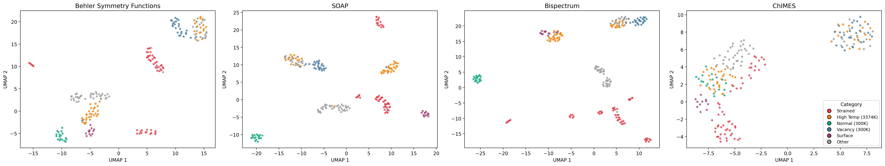
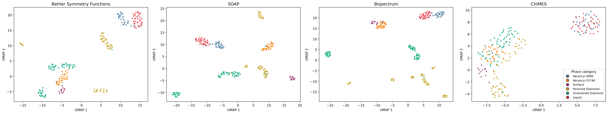
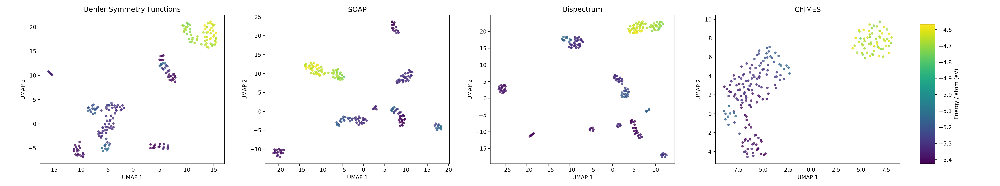

# Unsupervised baseline UMAPs

Fully unsupervised UMAP of Si descriptor spaces (Behler / SOAP / Bispectrum / ChIMES).
**All category and energy colors are post-hoc overlays** — UMAP and FPS never see labels or energies.

Baseline settings: `init=spectral`, `min_dist=0.9`, `n_neighbors=15`, `metric=euclidean`, `random_state=42`.

UMAP is visualization only; FPS pruning runs in scaled high-$D$ space.

---

## Prerequisites (clone-and-run)

This folder alone is **not** enough to regenerate the figures. Large / shared inputs live elsewhere in the repo (or are gitignored) and must be present before you run the scripts.

### Required files (not shipped inside this directory)

| Path (from repo root) | Approx. size | Role | Usually in git? |
|----------------------|--------------|------|-----------------|
| `data.json` | ~2.5 MB | 214 Si structures + DFT energies | yes (repo root) |
| `analysis/categorization.py` | small | Legacy + phase label rules | yes (must be committed with analysis) |
| `analysis/umap/unsupervised/scripts/umap_helpers.py` | — | Descriptor load/compute, UMAP, plotting helpers | yes |

### Large / optional inputs for descriptors

Provide **at least one** of these paths so Behler / SOAP / Bispectrum / ChIMES can be loaded:

| Path | Approx. size | Role | Notes |
|------|--------------|------|--------|
| `analysis/umap/descriptor_cache/structure_descriptors.npz` | ~2 MB | Precomputed structure-level descriptors (keys: `behler`, `soap`, `bispectrum`, `chimes`) | yes; see `../descriptor_cache/README.md` |
| `descriptors/chimes/frames_descriptors.pkl` | ~70 MB | Raw ChIMES force-design matrices | **gitignored**; needed only if cache lacks `chimes` |
| (recompute via dscribe / maml) | — | SOAP / Behler / Bispectrum | Needs packages (+ LAMMPS for Behler/Bispectrum) if cache missing |

If the cache exists with keys `behler`, `soap`, `bispectrum`, `chimes`, regenerate **without** LAMMPS or the ChIMES pickle.

### Python packages

Prefer the repo-root **uv** environment (pinned in `pyproject.toml` / `uv.lock`,
includes `umap-learn`):

```bash
# from repo root
uv sync
uv run python analysis/umap/unsupervised/scripts/generate_unsupervised_umaps.py
```

Alternatively, create a local venv under `analysis/umap/.venv` and install
`numpy`, `scipy`, `matplotlib`, `scikit-learn`, `pymatgen`, `ase`, `monty`,
`dscribe`, `maml`, and `umap-learn` (LAMMPS on `PATH` if recomputing Behler /
Bispectrum without a descriptor cache).

### Other system prerequisites

| Requirement | Needed when |
|-------------|-------------|
| **Python ≥ 3.9** | Always |
| **LAMMPS** on `PATH` (`lmp_serial`, `lmp_mpi`, or `lmp`) | Recomputing Behler / Bispectrum without a full descriptor cache. e.g. `conda install -c conda-forge lammps` or Homebrew |
| **matplotlib GUI / Agg** | Figure writing (headless OK with default Agg) |

### What this directory *does* include

| Path | Content |
|------|---------|
| `scripts/relabel_phase_categories.py` | Build phase-labeled JSON |
| `scripts/generate_unsupervised_umaps.py` | Run UMAP + write figures |
| `scripts/umap_helpers.py` | Descriptor / UMAP / plot helpers |
| `data/data_phase_categories.json` | Labeled copy of `data.json` (regenerable) |
| `figures/...` | Pre-rendered PNGs (viewable without running) |
| `README.md` | This file |

---

## Quick start

From **repo root**, after prerequisites are in place:

```bash
# 1) Environment (once)
python3 -m venv analysis/umap/.venv
source analysis/umap/.venv/bin/activate   # Windows: analysis\umap\.venv\Scripts\activate
pip install -U pip
pip install numpy scipy matplotlib scikit-learn pymatgen ase monty dscribe maml umap-learn

# 2) Labels (writes data/data_phase_categories.json)
./analysis/umap/.venv/bin/python \
  analysis/umap/unsupervised/scripts/relabel_phase_categories.py

# 3) UMAP figures (uses descriptor_cache/structure_descriptors.npz if present)
./analysis/umap/.venv/bin/python \
  analysis/umap/unsupervised/scripts/generate_unsupervised_umaps.py

# Optional: force descriptor recompute
./analysis/umap/.venv/bin/python \
  analysis/umap/unsupervised/scripts/generate_unsupervised_umaps.py --force-recompute
```

Outputs:

| Path | Content |
|------|---------|
| `figures/original_categories/umap_by_category.png` | Legacy labels |
| `figures/phase_categories/umap_by_phase.png` | Phase labels |
| `figures/energy_per_atom/umap_by_energy.png` | Energy/atom overlay |

---

## Data preprocessing

**Per structure**

1. Atomic features $N \times d$ (or $3N \times d$ for ChIMES force-basis rows)
2. mean $\Vert$ std aggregation: $\mathbf{x}=[\bar{\mathbf{v}},\,\mathrm{std}(\mathbf{v})]$ → length $2d$
3. One structure vector $\mathbf{x}\in\mathbb{R}^{2d}$

**Full dataset (214 structures)**

1. Stack → $214 \times 2d$ feature matrix
2. `StandardScaler` (column-wise: mean 0, variance 1)
3. UMAP → $214 \times 2$ (plot only)

```text
Atomic features (N x d, or 3N x d for ChIMES)
        |
        v
mean || std  -->  one structure vector x in R^{2d}
        |
        v
stack all frames  -->  214 x 2d
        |
        v
StandardScaler (mean 0, var 1)
        |
        v
UMAP  -->  214 x 2  (plot only)
```

Feature widths $d$: Behler 27, Bispectrum 56, ChIMES 231, SOAP 324  
(structure-level $D=2d$ after mean||std).

---

## Original categories



- **Normal (300K) vs High Temp / Other**
  - SOAP / Bispectrum isolate 300 K crystal; mid-$T$ (Other) and liquid-like (High Temp) frames leave the diamond multipole pattern
  - Behler still separates Normal but with less margin
  - ChIMES keeps Normal nearer the mixed hot/defect cloud
- **Strained** — elastic modes change both $r$ and $\theta$
  - Angular descriptors (Behler / SOAP / Bispectrum) split strained cells into several islands (mode / magnitude)
  - ChIMES merges them toward a continuum of distorted crystals
- **Vacancy (300K)** — local undercoordination is an angular / coordination signal
  - Well isolated in SOAP / Bispectrum / Behler
  - In ChIMES it bleeds into High Temp / Other via shared broad pair correlation
- **Surface** — incomplete neighbor shell
  - Strong odd multipoles in SOAP / Bispectrum
  - For ChIMES, missing pairs change force-basis rows, which can resemble other defective / low-coordination frames after mean||std pooling

> This Si dataset’s manmade categories are largely **angular-order** categories: perfect tetrahedral crystal, strained crystal, melt, surface, vacancy.

---

## Phase categories



### Strained vs unstrained diamond

- **Unstrained Diamond** = ground state + normal AIMD at $T \le 1518\,\mathrm{K}$ (still solid / tetrahedral by coordination-number diagnostics)
- **Strained Diamond** = elastic $2\times2\times2$ mode/strain cells
- All three local fingerprints (Behler, SOAP, Bispectrum) pull Strained Diamond off Unstrained Diamond
  - Strain lowers symmetry ($Fd\bar{3}m$ → a lower-symmetry space group) and splits nearest-neighbor distances/angles
- **Within Strained**
  - Bispectrum resolves the most mode / magnitude islands
  - SOAP and Behler look more alike: fewer separations, coarser grouping of strain cells
- **Why ChIMES softens the split**
  - The force design matrix varies smoothly with $r_{ij}$; strain is a continuous path from the unstrained crystal in that metric (and we never had invariant per-atom fingerprints to begin with)

### Liquid, vacancies, surface

- **Liquid** (2530 / 3374 K normal AIMD): loss of orientational order + CN rise (~5.5). SOAP / Bispectrum respond strongly to isotropy of $\rho(\mathbf{r})$; ChIMES force rows mainly track broadened pair statistics — closer to other disordered frames after pooling
- **Vacancy-3374K** near diamond, not Liquid: snapshots remain CN ≈ 4 (crystal-like) and sit at low energy/atom. Angular per-atom descriptors correctly treat them as defective solids
- **Vacancy-300K**: clearer defect signal (undercoordinated neighbors) and high energy/atom; own island for Behler / SOAP / Bispectrum; ChIMES often pulls it toward Liquid via shared distance / force-basis patterns
- **Surface**: missing half-space of neighbors → high anisotropy for density expansions (SOAP / Bispectrum); for ChIMES it is a change in which force-basis rows are active, more easily confused with other defects after mean||std

---

## DFT potential energy / atom



Same unsupervised embedding as the category maps; only the color changes.

- **High-$E$** aligns with **Liquid** and **Vacancy-300K**
- **Low-$E$** aligns with **Unstrained Diamond**, **Strained Diamond**, and **Vacancy-3374K**
- Here **temperature ≠ energy** (not thermo energy): Vacancy-3374K is low-$E$; Vacancy-300K is high-$E$ (denser cells / higher PotEng)
- **Behler / SOAP / Bispectrum**: several purple (low-$E$) islands = distinct low-$E$ structures (crystal vs strain modes vs hot vacancy) — **structure**, not energy, drives the split
- **ChIMES**: 2-part cloud; force-basis / PotEng-aligned split — consistent with a representation built for forces, not angular-order categories

---

## Thoughts (FPS implications)

These are **hypotheses** suggested by UMAP (2-D manifold, not raw high-$D$ distances) + descriptor functional forms. Confirm with FPS category-composition curves.

- FPS / UMAP use **descriptor distances only** — no energies, no category labels
- FPS in SOAP / Bispectrum space may **oversample** rare angular environments (surfaces, distinct strain modes) because they sit far from the diamond core in those metrics — matching the sharp UMAP islands
- FPS in ChIMES space may **undersample** Surface (buried in the large mixed cloud) and **oversample** Vacancy-300K (in the smaller high-$E$ cloud with Liquid), matching the diffuse / two-cloud UMAP
- Interpret cautiously: ChIMES force-basis space is not the same geometric object as SOAP space
